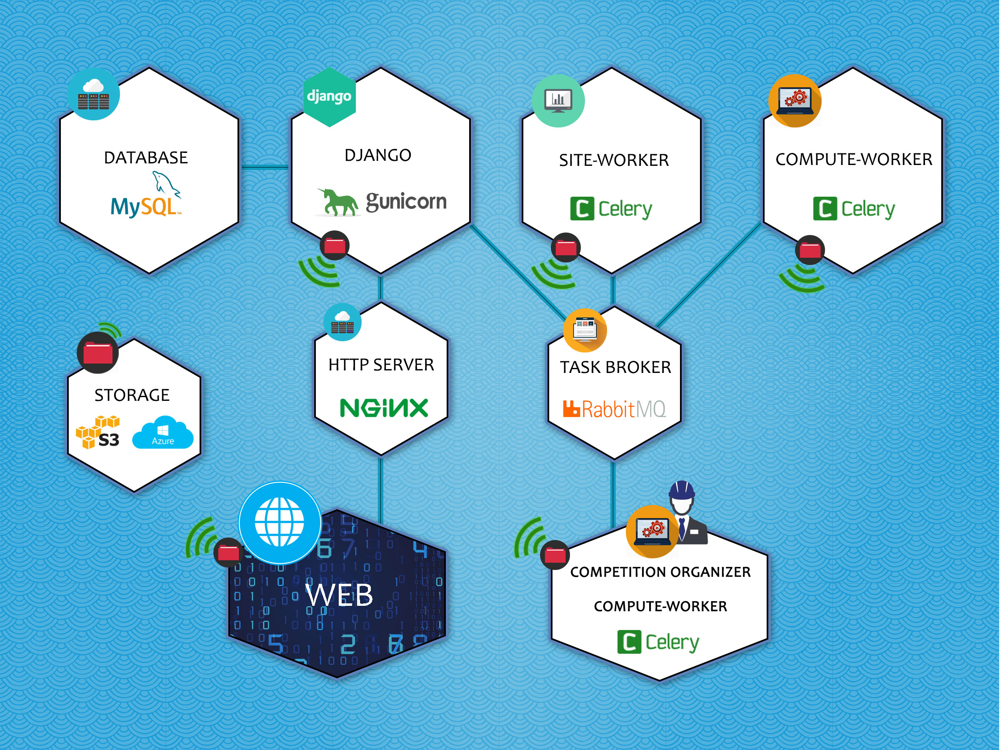

<h1>Codalab Competitions architecture</h1>

### Docker

We use docker to manage our local development and deploy our environments because 
it provides an increased level of reproducibility. It used to take hours to setup
each piece of Codalab, but now it should be a bit more simple. It is still a bit
tedious to have to setup Azure or S3 Storage, but this can be changed in the future.

### Django

Django is the bread and butter of Codalab Competition's side. We use it to interact 
with our database, migrate the database state, and fire off our asynchronous tasks.

### MySQL

Our data storage. Not the ideal choice, but it's what we're currently using
to store data.

### RabbitMQ

We use RabbitMQ as our task message broker. It is simple, resilient, comes with nice
management tools to assist with debugging:

&mdash; RabbitMQ Management

&mdash; Flower

### Celery

This is our task queue where we execute long running tasks, like:

* Creating a competition
* Evaluating a submission
* Sending mass emails
* Re-running all submissions in a phase
* Schedule tasks

Also, by decoupling the worker from the project as much as we have, we can allow 
competition organizers to run their own celery workers to consume submissions. 
They don't need access to storage keys like before, because we pass around signed
urls with access to read/write.

Celery and RabbitMQ basically replaced what the Service Bus provided in our project
a few months ago (as of March 2017).

### Nginx

A simple HTTP server to handle web requests. We can use this to cache static pages 
and handle huge influxes of traffic if we need to.
